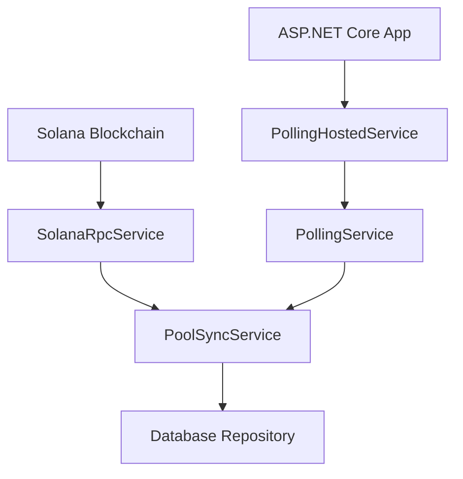

# Phase 3: Blockchain Integration Implementation Guide

## Overview

Phase 3 adds comprehensive blockchain integration to the Fixed Ratio Trading Dashboard. This layer enables automatic synchronization of pool data, system state, and transaction history from the Solana blockchain to the local database.

## Architecture

### 🏗️ **Service Layer Structure**

```
FixedRatioTrading.Dashboard.Solana/
├── Services/
│   ├── ISolanaRpcService.cs        # Blockchain communication interface
│   ├── SolanaRpcService.cs         # Solnet RPC implementation
│   ├── IPoolSyncService.cs         # Pool synchronization interface
│   ├── PoolSyncService.cs          # Pool sync implementation
│   ├── IPollingService.cs          # Polling service interface
│   ├── PollingService.cs           # Polling implementation
│   └── PollingHostedService.cs     # Background service wrapper
├── DependencyInjection.cs          # Service registration
└── FixedRatioTrading.Dashboard.Solana.csproj
```

### 🔄 **Data Flow**



## Core Services

### 1. **SolanaRpcService** 
*Handles blockchain communication*

```csharp
public interface ISolanaRpcService
{
    Task<PoolStateData?> GetPoolStateAsync(string poolAddress);
    Task<SystemStateData?> GetSystemStateAsync(string systemStateAddress);
    Task<IEnumerable<string>> GetRecentPoolTransactionsAsync(string poolAddress, int limit = 50);
    Task<TransactionData?> GetTransactionDetailsAsync(string signature);
    Task<ulong> GetTokenAccountBalanceAsync(string accountAddress);
}
```

**Key Features:**
- ✅ Pool state deserialization from blockchain accounts
- ✅ System state monitoring
- ✅ Transaction history retrieval
- ✅ Token account balance queries
- ✅ Bulk account data fetching
- ❌ **TODO**: Implement proper binary deserialization for smart contract data structures

### 2. **PoolSyncService** 
*Synchronizes pool data between blockchain and database*

```csharp
public interface IPoolSyncService
{
    Task<Pool?> SyncPoolAsync(string poolAddress);
    Task<IEnumerable<Pool>> SyncPoolsAsync(IEnumerable<string> poolAddresses);
    Task<int> SyncAllPoolsAsync(string? network = null);
    Task<SystemState?> SyncSystemStateAsync(string systemStateAddress);
    Task<int> DiscoverNewPoolsAsync(ulong fromSlot, ulong? toSlot = null);
}
```

**Key Features:**
- ✅ Individual pool synchronization
- ✅ Bulk pool synchronization with parallel processing
- ✅ System state synchronization
- ✅ Database update/create logic
- ✅ Incremental sync tracking via slot numbers
- ❌ **TODO**: Pool discovery by scanning blockchain logs
- ❌ **TODO**: Transaction synchronization
- ❌ **TODO**: Token metadata resolution

### 3. **PollingService** 
*Manages periodic blockchain polling*

```csharp
public interface IPollingService
{
    bool IsRunning { get; }
    Task StartAsync(PollingConfiguration configuration, CancellationToken cancellationToken = default);
    Task StopAsync(CancellationToken cancellationToken = default);
    Task TriggerPollAsync(CancellationToken cancellationToken = default);
    Task<PollingStatistics> GetStatisticsAsync();
}
```

**Key Features:**
- ✅ Configurable polling intervals
- ✅ Manual poll triggering
- ✅ Comprehensive statistics tracking
- ✅ Error handling and retry logic
- ✅ Event notifications for poll completion/errors
- ✅ Graceful start/stop management

## Configuration

### 1. **appsettings.json Setup**

```json
{
  "Solana": {
    "RpcUrl": "https://api.testnet.solana.com",
    "Network": "testnet",
    "ProgramId": "YOUR_PROGRAM_ID_HERE",
    "SystemStateAddress": "YOUR_SYSTEM_STATE_ADDRESS_HERE",
    "RequestTimeoutSeconds": 30,
    "MaxRetryAttempts": 3,
    "EnableLogging": true
  }
}
```

### 2. **Dependency Injection Setup**

In `Program.cs`:

```csharp
// Add Solana blockchain integration
builder.Services.AddSolanaIntegration(builder.Configuration);

// Optional: Add background polling service
builder.Services.AddSolanaPollingHostedService(new PollingConfiguration
{
    PollInterval = TimeSpan.FromMinutes(2),
    PoolDiscoveryInterval = TimeSpan.FromMinutes(10),
    SystemStateInterval = TimeSpan.FromMinutes(5),
    MaxTransactionsPerPool = 50,
    MaxConcurrentPools = 10,
    EnablePoolDiscovery = true,
    SyncTransactions = true,
    SyncSystemState = true,
    Network = "testnet"
});
```

### 3. **Manual Service Configuration**

```csharp
builder.Services.AddSolanaIntegration(config =>
{
    config.RpcUrl = "https://api.testnet.solana.com";
    config.Network = "testnet";
    config.ProgramId = "YOUR_PROGRAM_ID";
    config.SystemStateAddress = "YOUR_SYSTEM_STATE_ADDRESS";
    config.RequestTimeoutSeconds = 60;
    config.MaxRetryAttempts = 5;
});
```

## Usage Examples

### 1. **Manual Pool Synchronization**

```csharp
[ApiController]
[Route("api/[controller]")]
public class SyncController : ControllerBase
{
    private readonly IPoolSyncService _poolSyncService;

    [HttpPost("pool/{poolAddress}")]
    public async Task<IActionResult> SyncPool(string poolAddress)
    {
        var pool = await _poolSyncService.SyncPoolAsync(poolAddress);
        return Ok(new { success = pool != null, pool });
    }

    [HttpPost("all-pools")]
    public async Task<IActionResult> SyncAllPools()
    {
        var count = await _poolSyncService.SyncAllPoolsAsync();
        return Ok(new { success = true, poolsSynced = count });
    }
}
```

### 2. **Polling Service Control**

```csharp
[ApiController]
[Route("api/[controller]")]
public class PollingController : ControllerBase
{
    private readonly IPollingService _pollingService;

    [HttpPost("trigger")]
    public async Task<IActionResult> TriggerPoll()
    {
        await _pollingService.TriggerPollAsync();
        return Ok(new { success = true, message = "Poll triggered" });
    }

    [HttpGet("statistics")]
    public async Task<IActionResult> GetStatistics()
    {
        var stats = await _pollingService.GetStatisticsAsync();
        return Ok(stats);
    }
}
```

### 3. **Event Handling**

```csharp
public class PollingEventHandler
{
    private readonly ILogger<PollingEventHandler> _logger;

    public PollingEventHandler(IPollingService pollingService, ILogger<PollingEventHandler> logger)
    {
        _logger = logger;
        pollingService.PollCompleted += OnPollCompleted;
        pollingService.PollError += OnPollError;
    }

    private void OnPollCompleted(object? sender, PollCompletedEventArgs e)
    {
        _logger.LogInformation("Synchronized {PoolCount} pools in {Duration}", 
            e.PoolsSynced, e.Duration);
    }

    private void OnPollError(object? sender, PollErrorEventArgs e)
    {
        _logger.LogError("Polling error: {Error}", e.ErrorMessage);
    }
}
```

## Monitoring & Observability

### 1. **Polling Statistics**

```csharp
public class PollingStatistics
{
    public DateTime ServiceStartTime { get; set; }
    public TimeSpan TotalRuntime { get; set; }
    public int TotalPollCycles { get; set; }
    public int SuccessfulCycles { get; set; }
    public int FailedCycles { get; set; }
    public DateTime? LastSuccessfulPoll { get; set; }
    public int PoolsSynced { get; set; }
    public int TransactionsSynced { get; set; }
    public TimeSpan AverageCycleTime { get; set; }
    public string? LastError { get; set; }
    public int ConsecutiveFailures { get; set; }
}
```

### 2. **Health Checks**

```csharp
builder.Services.AddHealthChecks()
    .AddCheck<SolanaHealthCheck>("solana-rpc")
    .AddCheck<PollingHealthCheck>("polling-service");
```

## Implementation TODOs

### 🔴 **Critical - Required for Production**

1. **Binary Deserialization** 
   - Implement proper Rust struct deserialization in `SolanaRpcService`
   - Parse `PoolState` and `SystemState` from binary account data
   - Handle Anchor/Borsh serialization format

2. **Transaction Parsing**
   - Parse transaction instructions to determine transaction type
   - Extract token amounts and user addresses from transaction data
   - Map instruction data to `TransactionType` enum

3. **Token Metadata Resolution**
   - Fetch token metadata (symbols, names, decimals) from token mint accounts
   - Update pool creation to include proper token information
   - Cache token metadata to avoid repeated RPC calls

### 🟡 **Important - Enhances Functionality**

4. **Pool Discovery**
   - Implement `DiscoverNewPoolsAsync` by scanning program logs
   - Parse pool creation events from transaction history
   - Automatically sync newly discovered pools

5. **Transaction Synchronization**
   - Implement `SyncPoolTransactionsAsync` and `SyncAllPoolTransactionsAsync`
   - Parse recent transactions for each pool
   - Store transaction history in database

6. **Error Recovery**
   - Implement exponential backoff for failed RPC calls
   - Add circuit breaker pattern for repeated failures
   - Queue failed operations for retry

### 🟢 **Nice to Have - Performance & UX**

7. **Caching Layer**
   - Add Redis caching for frequently accessed data
   - Cache token metadata and pool states
   - Implement cache invalidation strategies

8. **WebSocket Support**
   - Add real-time updates via Solana WebSocket subscriptions
   - Push live pool updates to dashboard clients
   - Reduce polling frequency with real-time notifications

9. **Advanced Analytics**
   - Track pool performance metrics over time
   - Calculate APY and volume statistics
   - Generate trending pool reports

## Testing Strategy

### 1. **Unit Tests**
- Mock Solana RPC responses for service testing
- Test pool synchronization logic with known data
- Validate configuration and dependency injection

### 2. **Integration Tests**
- Test against Solana testnet
- Verify end-to-end synchronization flow
- Test polling service lifecycle

### 3. **Performance Tests**
- Measure synchronization performance with large pool counts
- Test concurrent pool synchronization
- Monitor memory usage during long-running operations

## Security Considerations

### 🔒 **Read-Only Operations**
- All blockchain integration is **READ-ONLY**
- No private keys or signing capabilities
- Safe for production deployment

### 🔒 **Rate Limiting**
- Respect Solana RPC rate limits
- Implement request throttling
- Use public RPC endpoints responsibly

### 🔒 **Data Validation**
- Validate all blockchain data before database storage
- Sanitize account addresses and transaction signatures
- Handle malformed or unexpected data gracefully

## Deployment Notes

### 1. **Environment Configuration**
- Testnet: Use `https://api.testnet.solana.com`
- Mainnet: Use `https://api.mainnet-beta.solana.com` or dedicated RPC provider
- Devnet: Use `https://api.devnet.solana.com` for development

### 2. **Resource Requirements**
- Minimal CPU usage for periodic polling
- Network bandwidth for RPC calls
- Database storage for synchronized data

### 3. **Scaling Considerations**
- Horizontal scaling: Multiple instances can sync different pool sets
- Vertical scaling: Increase concurrent pool processing
- Database optimization: Index key fields for query performance

---

## ✅ **Phase 3 Status: INFRASTRUCTURE COMPLETE**

**Ready for Phase 4 (Web Layer)** once the binary deserialization TODOs are addressed.

The blockchain integration layer provides a solid foundation for real-time pool monitoring and data synchronization. The modular design allows for incremental improvements while maintaining production stability. 