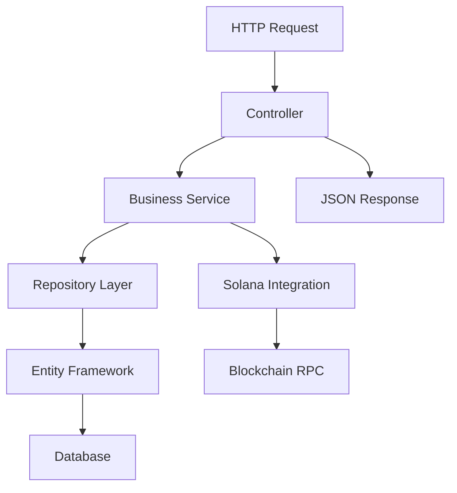

# Phase 4: Web Layer Implementation Guide

## Overview

Phase 4 completes the web application layer of the Fixed Ratio Trading Dashboard. This layer provides REST API endpoints, business services, and web interface capabilities for interacting with the pool data and blockchain integration.

## Architecture

### 🏗️ **Layer Structure**

```
FixedRatioTrading.Dashboard.Web/
├── Controllers/
│   ├── PoolController.cs          # Pool management API
│   ├── SystemController.cs        # System monitoring API
│   └── HomeController.cs          # Web pages (existing)
├── Services/
│   ├── IPoolService.cs            # Business logic interface
│   ├── PoolService.cs             # Business logic implementation
│   └── [Future: ITokenService, etc.]
├── Models/                        # View models (existing)
├── Views/                         # Web UI (existing)
├── wwwroot/                       # Static assets
├── Program.cs                     # Application configuration
├── appsettings.json              # Configuration
└── [Project file with dependencies]
```

### 🔄 **Request Flow**



## API Endpoints

### 🏊 **Pool Management** (`/api/pool`)

| Method | Endpoint | Description |
|--------|----------|-------------|
| `GET` | `/api/pool` | Get all pools (paginated, filterable) |
| `GET` | `/api/pool/{id}` | Get specific pool by ID |
| `GET` | `/api/pool/address/{address}` | Get pool by blockchain address |
| `GET` | `/api/pool/search?q={query}` | Search pools by token symbols/names |
| `GET` | `/api/pool/statistics` | Get pool statistics |
| `GET` | `/api/pool/{id}/transactions` | Get pool transactions |
| `POST` | `/api/pool/sync/{address}` | Manually sync pool from blockchain |
| `GET` | `/api/pool/top` | Get top pools by volume/liquidity |

### 🖥️ **System Monitoring** (`/api/system`)

| Method | Endpoint | Description |
|--------|----------|-------------|
| `GET` | `/api/system/state/{network}` | Get system state for network |
| `GET` | `/api/system/health` | System health check |
| `GET` | `/api/system/polling/statistics` | Polling service stats |
| `POST` | `/api/system/polling/trigger` | Trigger manual poll |
| `GET` | `/api/system/config` | Get system configuration |
| `GET` | `/api/system/metrics` | Get system metrics |

### 🔍 **API Documentation**

- **Swagger UI**: Available at `/api/docs` in development
- **Health Check**: Available at `/health`
- **OpenAPI Spec**: Available at `/swagger/v1/swagger.json`

## Business Services

### **IPoolService** - Pool Business Logic

```csharp
public interface IPoolService
{
    Task<PoolListResult> GetPoolsAsync(string? network = null, bool? isActive = null, int page = 1, int pageSize = 20);
    Task<PoolDetailsResult?> GetPoolAsync(Guid id);
    Task<PoolDetailsResult?> GetPoolByAddressAsync(string poolAddress);
    Task<PoolListResult> SearchPoolsAsync(string searchTerm, string? network = null, int page = 1, int pageSize = 20);
    Task<PoolStatistics> GetPoolStatisticsAsync(string? network = null);
    Task<IEnumerable<PoolTransactionResult>> GetPoolTransactionsAsync(Guid poolId, int limit = 50);
    Task<SyncResult> SyncPoolAsync(string poolAddress);
    Task<IEnumerable<PoolSummaryResult>> GetTopPoolsAsync(string sortBy = "volume", int count = 10, string? network = null);
}
```

**Key Features:**
- ✅ Paginated pool listing with filtering
- ✅ Pool search by token symbols/names
- ✅ Pool statistics and analytics
- ✅ Transaction history retrieval
- ✅ Manual blockchain synchronization
- ✅ Top pools by various criteria

## Data Transfer Objects

### **Response Models**

```csharp
// Summary for list views
public class PoolSummaryResult
{
    public Guid Id { get; set; }
    public string PoolAddress { get; set; }
    public string TokenASymbol { get; set; }
    public string TokenBSymbol { get; set; }
    public string Ratio => $"{RatioANumerator}:{RatioBDenominator}";
    public ulong TotalTokenALiquidity { get; set; }
    public ulong TotalTokenBLiquidity { get; set; }
    public bool IsActive { get; set; }
    public bool IsPaused { get; set; }
    // ... more fields
}

// Detailed view with relationships
public class PoolDetailsResult : PoolSummaryResult
{
    public string Owner { get; set; }
    public string TokenAMint { get; set; }
    public string TokenBMint { get; set; }
    public bool IsInitialized { get; set; }
    public ulong CollectedFeesTokenA { get; set; }
    public ulong CollectedFeesTokenB { get; set; }
    public IEnumerable<PoolTransactionResult> RecentTransactions { get; set; }
    // ... all pool fields
}
```

### **Pagination Support**

```csharp
public class PoolListResult
{
    public IEnumerable<PoolSummaryResult> Pools { get; set; }
    public int TotalCount { get; set; }
    public int Page { get; set; }
    public int PageSize { get; set; }
    public int TotalPages => (int)Math.Ceiling((double)TotalCount / PageSize);
}
```

## Configuration

### **appsettings.json**

```json
{
  "ConnectionStrings": {
    "DefaultConnection": "Host=localhost;Database=fixed_ratio_trading_dashboard;Username=postgres;Password=password"
  },
  "Solana": {
    "RpcUrl": "https://api.testnet.solana.com",
    "Network": "testnet",
    "ProgramId": "",
    "SystemStateAddress": "",
    "RequestTimeoutSeconds": 30,
    "MaxRetryAttempts": 3,
    "EnableLogging": true
  },
  "BackgroundPolling": {
    "Enabled": true,
    "IntervalMinutes": 2,
    "DiscoveryIntervalMinutes": 10,
    "SystemStateIntervalMinutes": 5,
    "MaxTransactionsPerPool": 50,
    "MaxConcurrentPools": 10,
    "EnablePoolDiscovery": false,
    "SyncTransactions": false,
    "SyncSystemState": true
  }
}
```

### **Program.cs Features**

```csharp
// Entity Framework with PostgreSQL
builder.Services.AddDbContext<DashboardDbContext>(options =>
    options.UseNpgsql(connectionString));

// Repository pattern implementations
builder.Services.AddScoped<IPoolRepository, PoolRepository>();
builder.Services.AddScoped<IPoolTransactionRepository, PoolTransactionRepository>();
builder.Services.AddScoped<ITokenRepository, TokenRepository>();
builder.Services.AddScoped<ISystemStateRepository, SystemStateRepository>();

// Solana blockchain integration
builder.Services.AddSolanaIntegration(builder.Configuration);

// Business services
builder.Services.AddScoped<IPoolService, PoolService>();

// Background polling (configurable)
builder.Services.AddSolanaPollingHostedService(pollingConfig);

// API documentation
builder.Services.AddSwaggerGen();

// Health checks
builder.Services.AddHealthChecks().AddDbContext<DashboardDbContext>();
```

## Repository Implementations

### **Completed Entity Framework Implementations**

✅ **PoolRepository** - Full implementation with all interface methods  
✅ **PoolTransactionRepository** - Complete with transaction-specific queries  
✅ **SystemStateRepository** - System state management and monitoring  
✅ **TokenRepository** - Token metadata and management  

**Key Features:**
- Complete CRUD operations for all entities
- Specialized query methods for business requirements
- Bulk operations for performance
- Search and filtering capabilities
- Relationship loading with Entity Framework

## API Response Format

### **Standard Response Structure**

```json
{
  "success": true,
  "data": { /* response data */ },
  "pagination": { /* for paginated endpoints */
    "currentPage": 1,
    "pageSize": 20,
    "totalCount": 150,
    "totalPages": 8
  }
}
```

### **Error Response Structure**

```json
{
  "success": false,
  "error": "Error description",
  "timestamp": "2024-01-01T00:00:00.000Z"
}
```

## Example API Usage

### **Get All Pools**

```bash
GET /api/pool?network=testnet&isActive=true&page=1&pageSize=10

Response:
{
  "success": true,
  "data": [
    {
      "id": "550e8400-e29b-41d4-a716-446655440000",
      "poolAddress": "9WzDXwBbmkg8ZTbNMqUxvQRAyrZzDsGYdLVL9zYtAWWM",
      "tokenASymbol": "BTC",
      "tokenBSymbol": "USDC",
      "ratio": "10000:1",
      "totalTokenALiquidity": 5000000,
      "totalTokenBLiquidity": 50000000000,
      "isActive": true,
      "isPaused": false,
      "createdAt": "2024-01-01T12:00:00Z"
    }
  ],
  "pagination": {
    "currentPage": 1,
    "pageSize": 10,
    "totalCount": 25,
    "totalPages": 3
  }
}
```

### **Get Pool Details**

```bash
GET /api/pool/550e8400-e29b-41d4-a716-446655440000

Response:
{
  "success": true,
  "data": {
    "id": "550e8400-e29b-41d4-a716-446655440000",
    "poolAddress": "9WzDXwBbmkg8ZTbNMqUxvQRAyrZzDsGYdLVL9zYtAWWM",
    "owner": "7xKXtg2CW87d97TXJSDpbD5jBkheTqA83TZRuJosgAsU",
    "tokenAMint": "So11111111111111111111111111111111111111112",
    "tokenBMint": "EPjFWdd5AufqSSqeM2qN1xzybapC8G4wEGGkZwyTDt1v",
    "tokenASymbol": "SOL",
    "tokenBSymbol": "USDC",
    "isInitialized": true,
    "collectedFeesTokenA": 125000,
    "collectedFeesTokenB": 2500000,
    "swapFeeBasisPoints": 30,
    "recentTransactions": [
      {
        "id": "...",
        "type": "Swap",
        "transactionSignature": "...",
        "userAddress": "...",
        "tokenAAmount": 1000000,
        "tokenBAmount": 50000000,
        "processedAt": "2024-01-01T12:30:00Z",
        "isSuccessful": true
      }
    ]
  }
}
```

### **System Health Check**

```bash
GET /api/system/health

Response:
{
  "success": true,
  "data": {
    "status": "healthy",
    "timestamp": "2024-01-01T12:00:00Z",
    "services": {
      "database": {
        "healthy": true,
        "message": "Database connection successful"
      },
      "solanaRpc": {
        "healthy": true,
        "message": "Solana RPC connection successful",
        "network": "testnet"
      },
      "polling": {
        "healthy": true,
        "message": "Polling service is running",
        "isRunning": true
      }
    }
  }
}
```

## Development Features

### **Swagger Integration**

- **Development URL**: `http://localhost:5000/api/docs`
- **Interactive API Testing**: Full Swagger UI with request/response examples
- **API Documentation**: Auto-generated from controller attributes

### **CORS Support**

- **Development**: Allows all origins, methods, headers
- **Production**: Should be configured for specific domains

### **Health Checks**

- **Database connectivity** validation
- **Solana RPC** connection testing
- **Background services** status monitoring

### **Auto Database Migration**

- **Development only**: Automatically applies Entity Framework migrations on startup
- **Production**: Manual migration deployment recommended

## Current Status

### ✅ **Completed Features**

1. **Complete API Layer**
   - Pool management endpoints
   - System monitoring endpoints
   - Swagger documentation
   - Health checks

2. **Business Services**
   - PoolService with full business logic
   - Data transformation and mapping
   - Error handling and logging

3. **Repository Layer**
   - All repository implementations complete
   - Entity Framework integration
   - Specialized query methods

4. **Configuration**
   - Complete appsettings.json setup
   - Dependency injection configuration
   - Background service integration

5. **Data Transfer Objects**
   - Response models for all scenarios
   - Pagination support
   - Error response handling

### 🔧 **Ready for Testing**

The Phase 4 web layer is functionally complete and ready for:

1. **API Testing**
   - Start the application: `dotnet run`
   - Access Swagger UI: `http://localhost:5000/api/docs`
   - Test endpoints with sample data

2. **Integration Testing**
   - Database operations through repositories
   - Blockchain integration through Solana services
   - Background polling service functionality

3. **Performance Testing**
   - Pagination and filtering performance
   - Concurrent request handling
   - Database query optimization

### 🎯 **Next Steps for Production**

1. **Database Setup**
   - Configure PostgreSQL connection string
   - Run Entity Framework migrations
   - Seed initial data

2. **Blockchain Configuration**
   - Set Solana RPC URL for target network
   - Configure program ID and system state address
   - Enable desired background polling features

3. **Security Hardening**
   - Configure CORS for production domains
   - Add authentication/authorization
   - Implement rate limiting

4. **Monitoring & Logging**
   - Configure structured logging
   - Add application performance monitoring
   - Set up health check monitoring

---

## ✅ **Phase 4 Status: COMPLETE & FUNCTIONAL**

**The web layer provides a complete REST API for pool management and system monitoring, with full integration to the blockchain layer and data persistence.**

**Ready for deployment and testing with proper configuration! 🚀** 